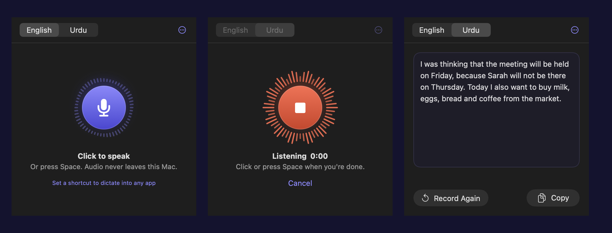

# Bitper

**Private dictation in your Mac's menu bar.** Click the mic, speak, and get the text to copy, or press a shortcut in any app and have the text typed for you. Speak English or Urdu; the text always comes out in English.

Everything runs on your Mac. No account, no cloud, no subscription. Your audio never leaves the machine.



## Features

- **One-click dictation** from the menu bar. Click the mic or press Space, speak, then click or press Space again.
- **Urdu to English:** speak Urdu and Bitper writes English, translated by Whisper in one step.
- **Dictate into any app:** set a shortcut (for example ⌥Space), press it in any text field, speak, press it again, and the text is typed where your cursor is. A small floating pill shows that it's listening.
- **History:** your last 10 dictations, ready to copy.
- **Fast:** under a second for English and about 1–2 seconds for Urdu on Apple Silicon.

## Requirements

- A Mac with Apple Silicon (M1 or newer). It also runs on Intel Macs, but slowly.
- macOS 14 Sonoma or newer
- [Homebrew](https://brew.sh)
- About 1 GB of free disk space for the models

## Install

```sh
git clone https://github.com/mubashiralikalhoro/bitper.git
cd bitper
./install.sh
```

The installer:

1. Checks for Xcode Command Line Tools (and starts their install if they're missing) and Homebrew.
2. Installs [whisper.cpp](https://github.com/ggml-org/whisper.cpp) with Homebrew.
3. Downloads the two speech models into `models/` (about 700 MB, one time only).
4. Copies the models to `~/Library/Application Support/Bitper/models`.
5. Builds `Bitper.app`, moves it to `/Applications` and opens it.

It's safe to run again. Steps that are already done are skipped. To update, `git pull` and run `./install.sh` again.

### First run

Look for the waveform icon in your menu bar.

1. **Microphone:** the first recording asks for microphone access. Click **Allow**.
2. **Shortcut (optional):** open **⋯ → Settings**, click **Click to set** and press a combination that includes ⌃ Control or ⌥ Option, for example ⌥Space. Bitper rejects shortcuts that macOS or another app already uses.
3. **Typing (optional):** in the same Settings page, click **Allow…** next to Typing and turn Bitper on under **Privacy & Security → Accessibility**. Without this, shortcut dictation copies the text to your clipboard instead of typing it.

To start Bitper when you log in: **System Settings → General → Login Items → +**, then choose Bitper.

## Use

| To | Do this |
|---|---|
| Dictate in the panel | Click the menu bar icon, click the mic or press **Space**, speak, press **Space** again |
| Dictate into any app | In a text field, press your shortcut, speak, press it again. **Esc** cancels |
| Speak Urdu | Switch **English / Urdu** at the top of the panel |
| Copy the result | **Copy** or **⌘C** |
| See past dictations | **⋯ → History**, then click one to open it |
| Change settings | **⋯ → Settings** |

## How it works

```
mic → 16 kHz WAV → whisper.cpp → text
```

Bitper records your voice and hands it to [whisper.cpp](https://github.com/ggml-org/whisper.cpp), which runs OpenAI's Whisper model on your Mac's GPU. The text Whisper returns is what you get.

| Model | Size | Used for |
|---|---|---|
| `ggml-base.en.bin` | 148 MB | English speech |
| `ggml-medium-q5_0.bin` | 540 MB | Urdu speech, translated to English |

**Urdu to English** happens inside Whisper itself. It was trained on speech in about 100 languages, including translating that speech straight into English. Bitper runs it with the Urdu language flag and the translate flag (`-l ur -tr`), so your Urdu goes directly to English text; it is never written in Urdu first. The medium model is used because smaller ones mistranslated common words in testing (for example "Thursday" came out as "teacher").

## Troubleshooting

**No waveform icon in the menu bar.** The menu bar may be full; quit another menu bar app or hold ⌘ and drag icons to make room. Check that Bitper is running in Activity Monitor.

**"Microphone access is off".** Open **System Settings → Privacy & Security → Microphone** and turn on Bitper.

**Shortcut dictation copies instead of typing.** Allow Bitper under **Privacy & Security → Accessibility**. If you rebuilt the app, macOS forgets this permission: remove Bitper from the list with **−**, then add it again.

**"Speech model missing".** Run `./install.sh` again to download it.

**"Couldn't run whisper-cli".** Run `brew install whisper-cpp`.

**Urdu comes out wrong.** Speak clearly and close to the mic. Whisper translates meaning, not word for word, and names or rare words may be misheard.

## Build from source

```sh
./build.sh          # builds Bitper.app in this folder and runs its self-test
open Bitper.app
```

The whole app is one file, `Bitper.swift` (SwiftUI, no Xcode project needed).
